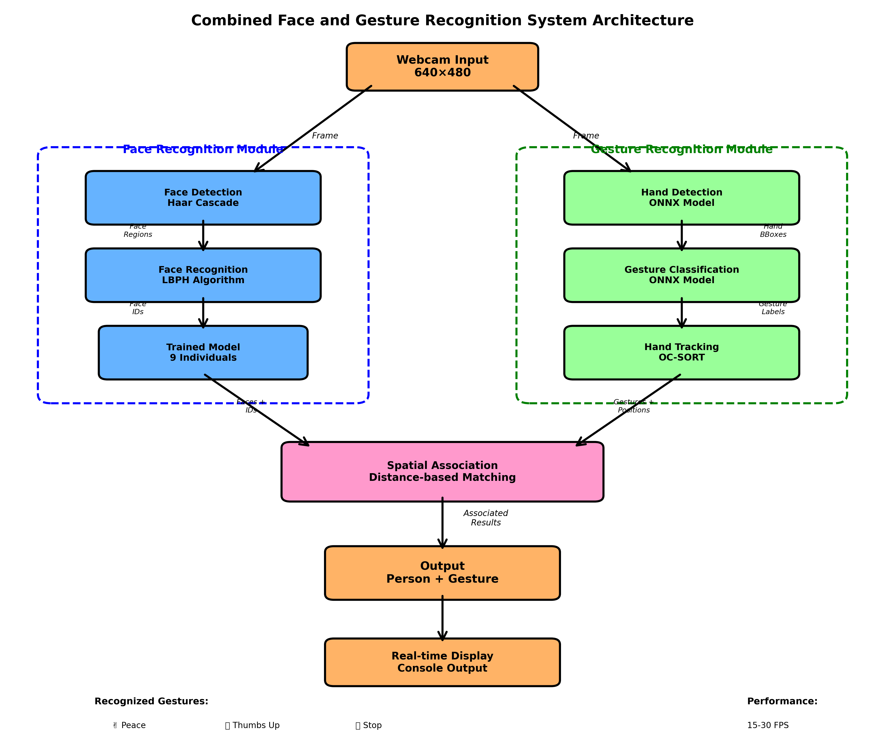

# Combined Face & Gesture Recognition System

[](https://www.python.org/downloads/)
[](LICENSE)
[](https://opencv.org/)
[](https://onnxruntime.ai/)

A real-time computer vision system that combines face recognition with hand gesture detection, capable of identifying both **who** is making gestures and **what** gestures they're making.



## Features

- **Real-time Face Recognition**: Identifies specific people using trained face models (LBPH algorithm)
- **Hand Gesture Detection**: Recognizes peace, thumbs up, and stop gestures
- **Smart Association**: Links gestures to specific individuals based on spatial proximity
- **Multi-person Support**: Handles multiple faces and hands simultaneously
- **Interactive Interface**: Live video feed with bounding boxes and console output
- **15-30 FPS Performance**: Real-time processing on standard hardware

## System Architecture

The system uses a hybrid approach combining classical computer vision (face recognition) with modern deep learning (gesture recognition):

- **Face Module**: Haar Cascade detection + LBPH recognition
- **Gesture Module**: ONNX neural networks (hand detection + gesture classification)
- **Tracking**: OC-SORT algorithm with Kalman filters
- **Association**: Distance-based spatial matching

## Installation

### Prerequisites

- Python 3.8+
- Webcam
- pip package manager

### Setup

1. Clone the repository:
```bash
git clone <your-repo-url>
cd dynamic_gestures
```

2. Create a virtual environment (recommended):
```bash
python -m venv .venv
source .venv/bin/activate  # On Windows: .venv\Scripts\activate
```

3. Install dependencies:
```bash
pip install -r requirements.txt
```

4. Verify setup (optional):
```bash
python scripts/verify_setup.py
```

## Usage

### Basic Usage

Run the main application:
```bash
python combined_face_gesture_recognition.py --debug
```

### Capture Images for Reports

Use the capture script to save screenshots:
```bash
python scripts/capture_report_images.py
```

**Controls during capture:**
- Press `1` - Capture single person with gesture
- Press `2` - Capture multi-person scenario
- Press `3` - Capture gesture examples
- Press `4` - Capture with bounding boxes
- Press `s` - Toggle debug mode
- Press `q` or ESC - Quit

### Retrain Face Recognition

To add or update your face in the system:
```bash
python scripts/retrain_my_face.py
```

This will:
1. Delete your old training images
2. Capture 120 new images of your face
3. Retrain the model with all users

### Interactive Controls

While running the system:
- **'q' or ESC**: Quit the application
- **'s'**: Toggle debug mode (show/hide bounding boxes)

## Project Structure

```
dynamic_gestures/
├── combined_face_gesture_recognition.py  # Main application
├── main_controller.py                    # Gesture recognition controller
├── onnx_models.py                        # Neural network wrappers
├── requirements.txt                      # Python dependencies
├── README.md                             # This file
│
├── scripts/                              # Utility scripts
│   ├── capture_report_images.py         # Image capture for reports
│   ├── retrain_my_face.py               # Face retraining script
│   └── run.py                           # Simple launcher
│
├── docs/                                 # Documentation & reports
│   ├── report.tex                       # IEEE format report
│   ├── system_architecture.tex          # TikZ diagram
│   ├── system_architecture.png          # Architecture diagram
│   ├── system_flow.png                  # Flow diagram
│   └── generate_architecture_diagram.py # Diagram generator
│
├── models/                               # Pre-trained ONNX models
│   ├── hand_detector.onnx
│   └── crops_classifier.onnx
│
├── ocsort/                               # Hand tracking algorithms
│   └── ...
│
├── utils/                                # Core utilities
│   ├── enums.py                         # Gesture definitions
│   ├── action_controller.py            # Gesture logic
│   ├── hand.py                          # Hand object class
│   └── drawer.py                        # Visualization
│
└── real-time-face-recognition-master/   # Face recognition system
    ├── haarcascade_frontalface_default.xml
    ├── trainer.yml                      # Trained face model (gitignored)
    ├── names.json                       # Face ID mappings
    └── src/                             # Face recognition source
```

## Output Examples

The system provides two types of detection output:

```bash
# Generic gesture detection
THUMBS UP gesture detected!
PEACE gesture detected!
STOP gesture detected!

# Person-specific detection (when face is recognized nearby)
EAC22076 made a THUMBS UP gesture!
EAC22015 made a PEACE gesture!
EAC22034 made a STOP gesture!
```

## Technical Details

### Face Recognition
- **Algorithm**: LBPH (Local Binary Pattern Histogram)
- **Detection**: Haar Cascade Classifiers
- **Training**: Pre-trained on 9 individuals (120 images each)
- **Confidence Threshold**: 100

### Gesture Recognition
- **Models**: ONNX neural networks from HaGRID dataset
- **Tracking**: OC-SORT algorithm with Kalman filters
- **Gestures**: Filtered to 3 essential gestures from 44 classes
- **Association Distance**: 200 pixels threshold

### Key Technologies
- **OpenCV**: Computer vision and image processing
- **ONNX Runtime**: Neural network inference
- **NumPy**: Numerical computations
- **SciPy**: Scientific computing utilities

## Applications

- **Interactive Presentations**: Track audience reactions
- **Accessibility**: Gesture-based controls for specific users
- **Security**: Person-specific gesture authentication
- **Education**: Monitor student engagement and responses
- **Gaming**: Person-aware gesture controls
- **Research**: Analyze gesture patterns by individual

## Customization

### Adding New People

1. Edit `retrain_my_face.py` to change the face ID and name
2. Run the script to capture images
3. The model will be automatically retrained

### Adding New Gestures

1. Modify `utils/enums.py` to include new gesture indices
2. Update filtering logic in `onnx_models.py`
3. Add gesture handling in `utils/action_controller.py`

## Performance

- **Real-time Processing**: 15-30 FPS on modern hardware
- **Multi-person Support**: Handles multiple faces and hands simultaneously
- **Robust Tracking**: Maintains hand IDs across frames with occlusion handling
- **Smart Association**: Only links gestures to faces when spatially reasonable

## Report Generation

An IEEE format LaTeX report is included in the `docs/` folder:

```bash
# Generate architecture diagrams
python docs/generate_architecture_diagram.py

# Compile the report
cd docs
pdflatex report.tex
bibtex report
pdflatex report.tex
pdflatex report.tex
```

## Troubleshooting

**No face recognition?**
- Ensure you're one of the trained individuals
- Check that `trainer.yml` exists in `real-time-face-recognition-master/`
- Run `python scripts/retrain_my_face.py` to add your face

**No gesture detection?**
- Verify `models/` folder contains ONNX files
- Make gestures clearly and hold them
- Ensure your hand is fully visible

**Low FPS?**
- Close other applications
- This is normal for CPU inference
- Consider GPU acceleration for better performance

## License

This project is based on the HaGRID dataset and follows the Apache License, Version 2.0.

## Acknowledgments

- **HaGRID Dataset**: For providing the gesture recognition foundation
- **OpenCV Community**: For computer vision tools and algorithms
- **ONNX Runtime**: For efficient neural network inference

## Contributing

Contributions are welcome! Please feel free to submit a Pull Request.

## Citation

If you use this system in your research, please cite:

```bibtex
@misc{combined_face_gesture_recognition,
  title={Real-Time Face and Gesture Recognition with Intelligent Association},
  author={Your Name},
  year={2024},
  publisher={GitHub},
  url={https://github.com/yourusername/dynamic_gestures}
}
```
